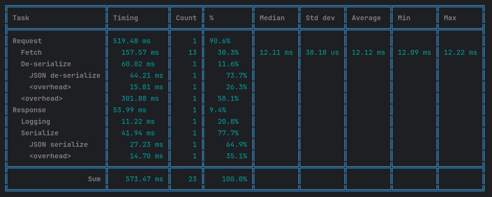
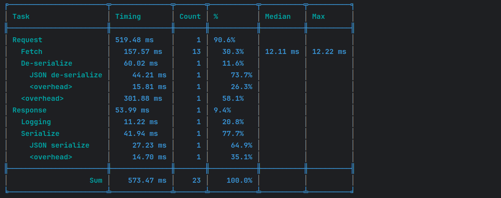
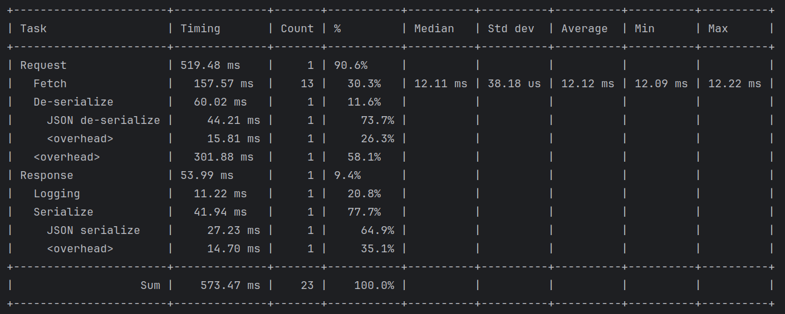
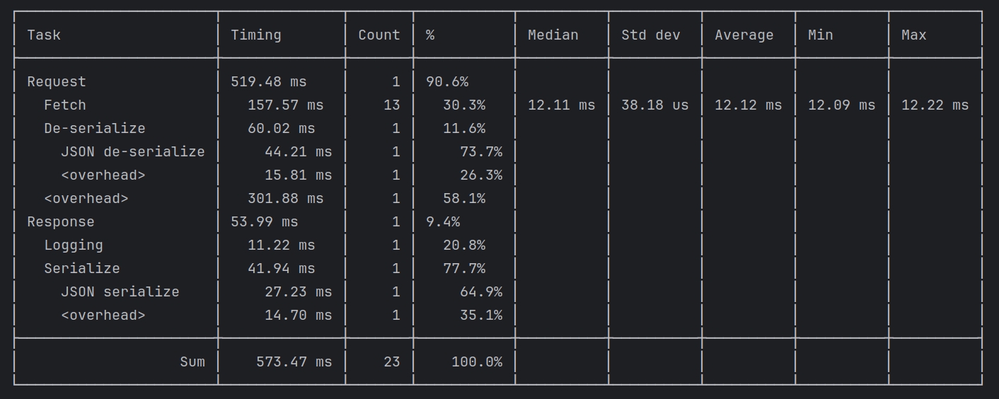

# Chronograph

[](http://search.maven.org/#search%7Cga%7C1%7Cg%3A%22com.ethlo.time%22%20a%3A%22chronograph%22)
[](https://javadoc.io/doc/com.ethlo.time/chronograph/latest/com/ethlo/time/Chronograph.html)
[](LICENSE)

Easy to use Java stopwatch allowing measurement of elapsed time.

## Features
  * New in 4.0: Hierarchical task tracking - Start several nested tasks.
  * The same task can be timed multiple times for aggregated/cumulative data.
  * Supports numerous metrics:
     - average
     - median
     - min/max
     - standard deviation
     - percentiles
     - percentage
     - count
     - total time
  * Human-readable durations
  * Highly tweaked code for minimal overhead.
  * Dynamic ASCII/Unicode table support for detailed result output on the console or in logs with support for colored output (ANSI console)
  * Easy to fetch the underlying data for when you need your own output format, like JSON
  * Configurable sample interval for very short running tasks
  * No dependencies

## Sample usage
```java
final Chronograph c = Chronograph.create();
c.time("Request", () ->
{
    for (int i = 0; i < 13; i++)
    {
        c.time("Fetch", () -> busy(12));
    }

    // Overhead
    busy(300);

    c.time("De-serialize", () ->
    {
        // Overhead
        busy(14);
        c.time("JSON de-serialize", () -> busy(44));
    });
});
```

Sample output in tables:


Or in JSON format if you need it for later analysis:

```json
{
  "tasks" : [ {
    "name" : "Request",
    "subtasks" : [ {
      "name" : "Fetch",
      "total_time" : "0.15757311",
      "subtasks_time" : "0",
      "self_time" : "0.15757311",
      "invocation_count" : 13,
      "statistics" : {
        "average" : "0.012121008",
        "median" : "0.012110195",
        "min" : "0.01208667",
        "max" : "0.012215087",
        "standard_deviation" : "0.000038184",
        "percentiles" : {
          "75.0" : "0.012130908",
          "90.0" : "0.012183143",
          "95.0" : "0.012215087",
          "99.0" : "0.012215087",
          "99.9" : "0.012215087"
        }
      }
    }, {
      "name" : "De-serialize",
      "subtasks" : [ {
        "name" : "JSON de-serialize",
        "total_time" : "0.044214251",
        "subtasks_time" : "0",
        "self_time" : "0.044214251",
        "invocation_count" : 1
      }, {
        "name" : "<overhead>",
        "total_time" : "0.015809396",
        "subtasks_time" : "0",
        "self_time" : "0.015809396",
        "invocation_count" : 1
      } ],
      "total_time" : "0.060023647",
      "subtasks_time" : "0.060023647",
      "self_time" : "0",
      "invocation_count" : 1
    }, {
      "name" : "<overhead>",
      "total_time" : "0.301883674",
      "subtasks_time" : "0",
      "self_time" : "0.301883674",
      "invocation_count" : 1
    } ],
    "total_time" : "0.519480431",
    "subtasks_time" : "0.519480431",
    "self_time" : "0",
    "invocation_count" : 1
  }, {
    "name" : "Response",
    "subtasks" : [ {
      "name" : "Logging",
      "total_time" : "0.011222603",
      "subtasks_time" : "0",
      "self_time" : "0.011222603",
      "invocation_count" : 1
    }, {
      "name" : "Serialize",
      "subtasks" : [ {
        "name" : "JSON serialize",
        "total_time" : "0.027233243",
        "subtasks_time" : "0",
        "self_time" : "0.027233243",
        "invocation_count" : 1
      }, {
        "name" : "<overhead>",
        "total_time" : "0.014704076",
        "subtasks_time" : "0",
        "self_time" : "0.014704076",
        "invocation_count" : 1
      } ],
      "total_time" : "0.041937319",
      "subtasks_time" : "0.041937319",
      "self_time" : "0",
      "invocation_count" : 1
    } ],
    "total_time" : "0.053987607",
    "subtasks_time" : "0.053159922",
    "self_time" : "0.000827685",
    "invocation_count" : 1
  } ]
}
```

## Getting started

### Include in your project

#### Maven coordinates
```xml
<dependency>
  <groupId>com.ethlo.time</groupId>
  <artifactId>chronograph</artifactId>
  <version>4.0.0</version>
</dependency>
``` 
### Usage 

#### Simple
```java
final Chronograph chronograph = Chronograph.create();
chronograph.start("my-task");
// perform a task
chronograph.stop();
System.out.printn(chronograph.prettyPrint());
```

#### Functional style with lamda

```java
final List<Long> myList = ...;
final Chronograph chronograph = Chronograph.create();     
chronograph.time("List sort", () -> linkedList.sort(Comparator.naturalOrder()));
System.out.println(chronograph);
```

### Choice of output columns
Empty columns will be dropped automatically. Included columns can be configured.

Begin from scratch:
```java
final OutputConfig outputConfig = new OutputConfig()
  .median(true)
  .standardDeviation(true);
``` 

Begin from DEFAULT configuration:
```java
final OutputConfig outputConfig = Chronograph.configure(OutputConfig.DEFAULT
  .percentiles(75, 90, 99, 99.9, 99.99));
```

```java
// Then use it like this

System.out.println(new TableOutputFormatter(outputConfig, TableTheme.RED_HERRING).format(chronograph.getData()));
```
### Reduced sample interval
If you run very quick tasks (typically less than milliseconds) in a loop, it may be beneficial to not capture every iteration, but instead sample some of them. This can be achieved by
```java
final Chronograph chronograph = Chronograph
    .create(CaptureConfig
        .minInterval(Duration.ofNanos(10_000))); // 10 microseconds
```

### Themes

You can choose to output the results using different styles and colors. Below are a few examples.






#### Make your own
```java
final TableTheme myTheme = TableTheme.builder()
    .stringColor(AnsiColor.BLUE)
    .numericColor(AnsiColor.GREEN)
    .horizontalSeparator(" ")
    .verticalSpacerColor(AnsiColor.GRAY)
    .horizontalSpacerColor(AnsiColor.GRAY)
    .build();
```

## Limitations

### Time resolution
This project is utilizing `System.nanoTime()` which has some inherent issues with very quick task times. It does have a nanosecond resolution, but not a nanosecond precision. These are still usually orders of magnitude away from what you are trying to measure, so it is not a problem. If you are micro-benchmarking, consider using a framework like [JMH](https://mvnrepository.com/artifact/org.openjdk.jmh/jmh-core).

If you would like to know more:
  * [https://docs.oracle.com/en/java/javase/11/docs/api/java.base/java/lang/System.html#nanoTime()](https://docs.oracle.com/en/java/javase/11/docs/api/java.base/java/lang/System.html#nanoTime())
  * [https://shipilev.net/blog/2014/nanotrusting-nanotime/#_timers](https://shipilev.net/blog/2014/nanotrusting-nanotime/#_timers)

### Thread safety
The Chronograph is NOT thread safe.
