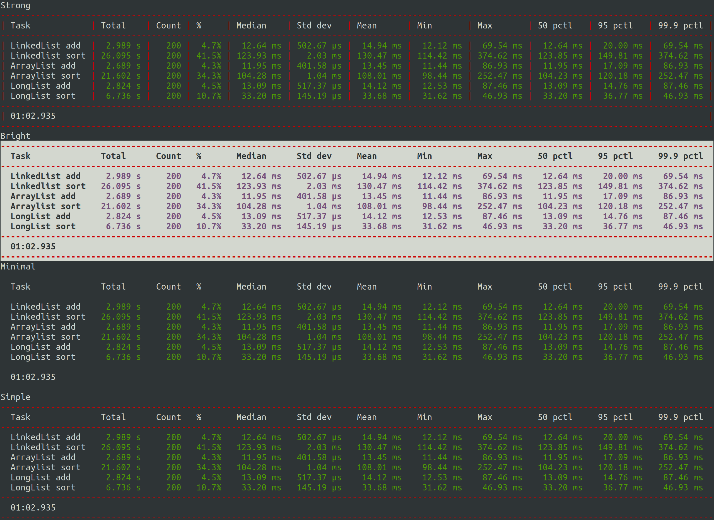

# Chronograph

[](http://search.maven.org/#search%7Cga%7C1%7Cg%3A%22com.ethlo.time%22%20a%3A%22chronograph%22)
[](LICENSE)
[](https://coveralls.io/github/ethlo/chronograph?branch=master)
[](https://travis-ci.org/ethlo/chronograph)
[](https://www.codacy.com/app/morten/chronograph?utm_source=github.com&amp;utm_medium=referral&amp;utm_content=ethlo/chronograph&amp;utm_campaign=Badge_Grade)

Easy to use Java Chronograph (stopwatch) allowing measurement of elapsed time.

## Features
  * The same task can be timed multiple times for aggregated/cumulative data.
  * Supports numerous metrics:
     - mean
     - median
     - min/max
     - max
     - standard deviation
     - percentiles
     - percentage
     - count
     - total time
  * Human-readable durations
  * Highly tweaked code for minimal overhead. Custom list for capturing results with as low overhead as possible.
  * Dynamic ASCII table support for detailed result output on the console or in logs
  * Support for colored output (ANSI console)
  * Easy to fetch the underlying data for when you need your own output format
  * No dependencies (~33KB jar file)

## Getting started

### Include in your project

#### Maven coordinates
```xml
<dependency>
  <groupId>com.ethlo.time</groupId>
  <artifactId>chronograph</artifactId>
  <version>1.0.1</version>
</dependency>
``` 

### Functional style with lamdas

#### Sample code
```java
final int size = 500_000;

final Chronograph c = Chronograph.createExtended();

for (int i = 0; i < 200; i++)
{
    final List<Long> linkedList = c.timedFunction("LinkedList add", this::addLinkedList, size);
    c.timed("Linkedlist sort", () -> linkedList.sort(Comparator.naturalOrder()));

    final List<Long> arrayList = c.timedFunction("ArrayList add", this::addArrayList, size);
    c.timed("Arraylist sort", () -> arrayList.sort(Comparator.naturalOrder()));

    final LongList longList = c.timedFunction("LongList add", this::addLongList, size);
    c.timed("LongList sort", longList::sort);
}

System.out.println(c.prettyPrint("List performance comparison", OutputConfig.ALL, TableTheme.NONE));
```
#### Output
```console
List performance comparison
----------------------------------------------------------------------------------------------------------------------------------------------
  Task              Total      Count   %       Median      Std dev     Mean        Min         Max         50 pctl     95 pctl     99.9 pctl  
----------------------------------------------------------------------------------------------------------------------------------------------
  LinkedList add     2.989 s     200    4.7%    12.64 ms   502.67 μs    14.94 ms    12.12 ms    69.54 ms    12.64 ms    20.00 ms    69.54 ms  
  Linkedlist sort   26.095 s     200   41.5%   123.93 ms     2.03 ms   130.47 ms   114.42 ms   374.62 ms   123.85 ms   149.81 ms   374.62 ms  
  ArrayList add      2.689 s     200    4.3%    11.95 ms   401.58 μs    13.45 ms    11.44 ms    86.93 ms    11.95 ms    17.09 ms    86.93 ms  
  Arraylist sort    21.602 s     200   34.3%   104.28 ms     1.04 ms   108.01 ms    98.44 ms   252.47 ms   104.23 ms   120.18 ms   252.47 ms  
  LongList add       2.824 s     200    4.5%    13.09 ms   517.37 μs    14.12 ms    12.53 ms    87.46 ms    13.09 ms    14.76 ms    87.46 ms  
  LongList sort      6.736 s     200   10.7%    33.20 ms   145.19 μs    33.68 ms    31.62 ms    46.93 ms    33.20 ms    36.77 ms    46.93 ms  
----------------------------------------------------------------------------------------------------------------------------------------------
  01:02.935                                                                                                                                   
----------------------------------------------------------------------------------------------------------------------------------------------
```

## Themes

You can choose to output the results using different styles and colors. Below are a few examples.




## Limitations
This project is utilizing `System.nanoTime()` which has some inherent issues with very quick task times. It does have a nanosecond resolution, but not a nanosecond precision. These are still usually orders of magnitude away from what you are trying to measure, so it is not a problem. If you are micro-benchmarking, consider using a framework like [JMH](https://mvnrepository.com/artifact/org.openjdk.jmh/jmh-core).

If you would like to know more:
  * [https://docs.oracle.com/en/java/javase/11/docs/api/java.base/java/lang/System.html#nanoTime()](https://docs.oracle.com/en/java/javase/11/docs/api/java.base/java/lang/System.html#nanoTime())
  * [https://shipilev.net/blog/2014/nanotrusting-nanotime/#_timers](https://shipilev.net/blog/2014/nanotrusting-nanotime/#_timers)
