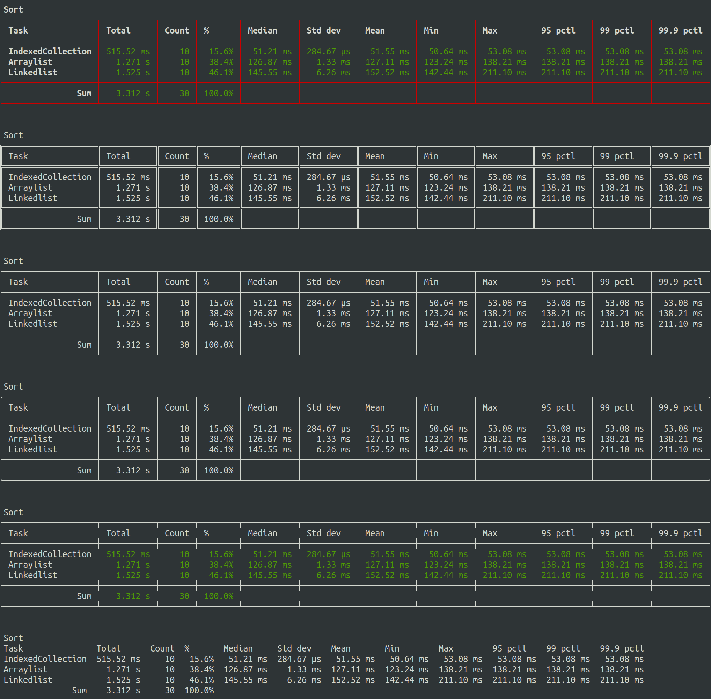

# Chronograph

[](http://search.maven.org/#search%7Cga%7C1%7Cg%3A%22com.ethlo.time%22%20a%3A%22chronograph%22)
[](LICENSE)
[](https://coveralls.io/github/ethlo/chronograph?branch=master)
[](https://travis-ci.org/ethlo/chronograph)
[](https://www.codacy.com/app/morten/chronograph?utm_source=github.com&amp;utm_medium=referral&amp;utm_content=ethlo/chronograph&amp;utm_campaign=Badge_Grade)

Easy to use Java Chronograph (stopwatch) allowing measurement of elapsed time.

## Features
  * The same task name can be timed multiple times.
  * Supports numerous metrics:
     - mean
     - median
     - min/max
     - max
     - standard deviation
     - percentiles
     - percentage
     - count
     - total time
  * Human-readable durations
  * Tuned code for minimal overhead. Custom list for capturing results with as low overhead as possible.
  * Dynamic ASCII table support for detailed result output on the console or in a log file
  * Easy to fetch the underlying data for when you need your own output format
  * No dependencies (~33KB jar file)

## Getting started

### Include in your project

#### Maven coordinates
```xml
<dependency>
  <groupId>com.ethlo.time</groupId>
  <artifactId>chronograph</artifactId>
  <version>1.0.1</version>
</dependency>
``` 

### Functional style with lamdas

```java
final int size = 10_000_000;
final int count = 10;

final Chronograph c = Chronograph.create();
for (int i = 0; i < count; i++)
{
    c.timed("LongList", () -> addLongList(size));
    c.timed("LinkedList", () -> addLinkedList(size));
    c.timed("ArrayList", () -> addArrayList(size));
}

System.out.println(c.prettyPrint());
```

*Add 10,000,000 long values 10 times*
```bash
----------------------------------------------------------------------------------------------------------------------------------------------------------
| Task                  | Average      | Min          | Max          | Median       | Std dev      | 90th pctl    | Total       | Invocations   | %      |    
----------------------------------------------------------------------------------------------------------------------------------------------------------
| LongList              |     76.56 ms |     70.12 ms |    145.22 ms |     72.83 ms |      2.15 ms |     85.84 ms |   765.65 ms |            10 |   6.5% |
| LinkedList            |    647.19 ms |     72.84 ms |    145.22 ms |    279.40 ms |    199.95 ms |      1.244 s |     6.472 s |            10 |  55.0% |
| ArrayList             |    453.46 ms |     81.07 ms |    145.22 ms |     84.41 ms |    337.66 ms |    163.18 ms |     4.535 s |            10 |  38.5% |
----------------------------------------------------------------------------------------------------------------------------------------------------------
| Total: 11.772 s                                                                                                                                        |
----------------------------------------------------------------------------------------------------------------------------------------------------------
```

## Themes

You can choose to output the results using different styles and colors. Below are a few examples.




## Limitations
This project is utilizing `System.nanoTime()` which has some inherent issues with very quick task times. It does have a nanosecond resolution, but not a nanosecond precision. These are still usually orders of magnitude away from what you are trying to measure, so it is not a problem. If you are micro-benchmarking, consider using a framework like [JMH](https://mvnrepository.com/artifact/org.openjdk.jmh/jmh-core).

If you would like to know more:
  * [https://docs.oracle.com/en/java/javase/11/docs/api/java.base/java/lang/System.html#nanoTime()](https://docs.oracle.com/en/java/javase/11/docs/api/java.base/java/lang/System.html#nanoTime())
  * [https://shipilev.net/blog/2014/nanotrusting-nanotime/#_timers](https://shipilev.net/blog/2014/nanotrusting-nanotime/#_timers)
